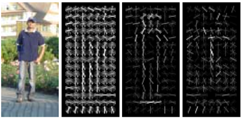
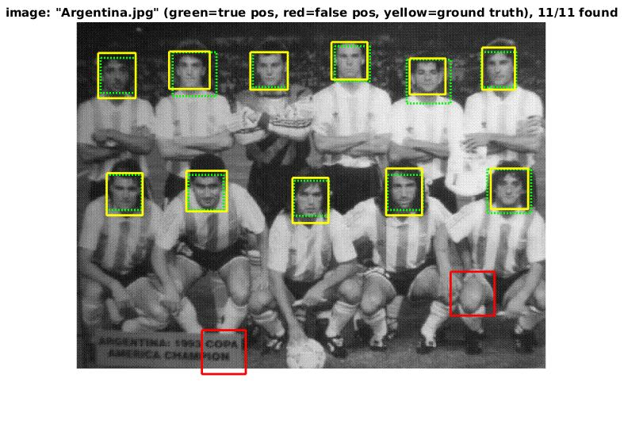
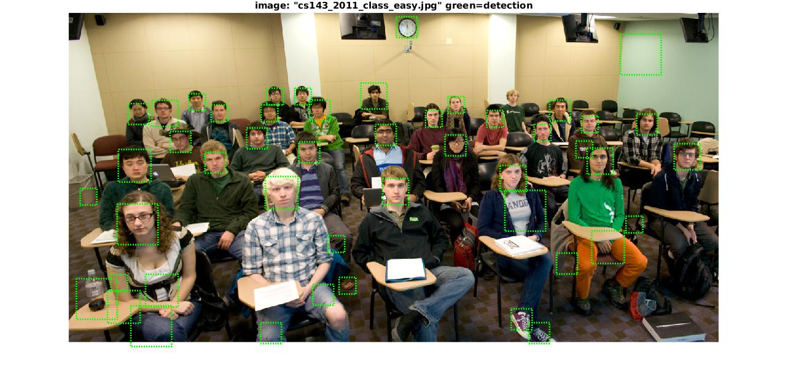
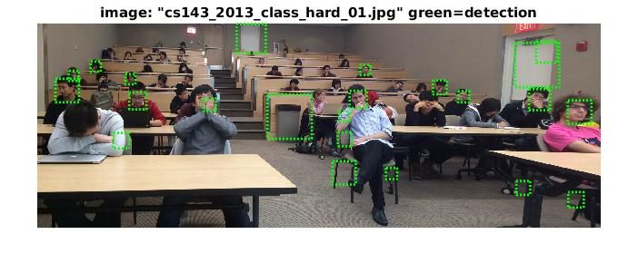

## Face Detection for COMP5421 CV Pro20
### Requirement
> Matlab, vlfeat toolbox

### Run
1. Open proj4.m
2. Click F5 to run the code

### Train 
1. Training data sets: 
> Positive examples: <a href="http://www.vision.caltech.edu/Image_Datasets/Caltech_10K_WebFaces/">Caltech Web Faces project </a>  
> Negative examples(non-face): <a href="http://groups.csail.mit.edu/vision/SUN/">SUN scene database</a>

2. Hog descriptors
> vl_hog()  
> 

3. Linear SVM
> vl_trainsvm()  
> 

### Test
1. On simple test datasets(CMU+MIT test set): **Yellow** bounding boxes are groundtruth, **green** bounding boxes are detecting results(true positive), while **red** bounding boxes are also detecting results(false positive).
> 
> <ima src="result/average_precision.png" width=300>
2. On challengous test datasets: no ground truth; more errors
> 
> 

### Demo Video

## Acknowledgement
- Thanks to the guidance of <a href="http://www.cs.ust.hk/~cktang/bio-sketch-review.htm">Prof.C.K.Tang</a> and the patient help from<a href="https://tailei.ram-lab.com/"> Tai lei</a>.

### Final Advice from Prof.C.K.Tang on how to improve accuracy
- The starter code has more specific advice about the necessary structure of variables through the code. However, the design of the functions is left up to you. You may want to create some additional functions to help abstract away the complexity of sampling training data and running the detector.
- You probably don't want to run non-max suppression while mining hard-negatives (extra credit).
- While the idea of mining for hard negatives is ubiquitous in the object detection literature, it may only modestly increase your performance when compared to a similar number of random negatives.
The parameters of the learning algorithms are important. The regularization parameter lambda is important for training your linear SVM. It controls the amount of bias in the model, and thus the degree of underfitting or overfitting to the training data. Experiment to find its best value.
- Your classifiers, especially if they are trained with large amounts of negative data, may "underdetect" because of an overly conservative threshold. You can lower the thresholds on your classifiers to improve your average precision. The precision-recall metric does not penalize a detector for producing false positives, as long as those false positives have lower confidence than true positives. For example, an otherwise accurate detector might only achieve 50% recall on the test set with 1000 detections. If you lower the threshold for a positive detection to achieve 70% recall with 5000 detections your average precision will increase, even though you are returning mostly false positives.
- When coding run_detector.m, you will need to decide on some important parameters. (1) The step size. By default, this should simply be the pixel width of your HoG cells. That is, you should step one HoG cell at a time while running your detector over a HoG image. However, you will get better performance if you use a fine step size. You can do this by computing HoG features on shifted versions of your image. This is not required, though -- you can get very good performance with sampling steps of 4 or 6 pixels. (2) The step size across scales, e.g. how much you downsample the image. A value of 0.7 (the image is downsampled to 70% of it's previous size recursively) works well enough for debugging, but finer search with a value such as 0.9 will improve performance. However, making the search finer scale will slow down your detector considerably.
- Likewise your accuracy is likely to increase as you use more of the training data, but this will slow down your training. You can debug your system with smaller amounts of training data (e.g. all positive examples and 10000 negative examples).
You can train and test a classifier with average precision of 0.85 in about 60 seconds. It is alright if your training and testing is slower, though.
- The Viola-Jones algorithm achieves an average precision of 0.895* on the CMU+MIT test set based on the numbers in Table 3 of the paper (This number may be slightly off because Table 3 doesn't fully specify the precision-recall curve, because the overlap criteria for VJ might not match our overlap criteria, and because the test sets might be slightly different -- VJ says the test set contains 507 faces, whereas we count 511 faces). You can beat this number, although you may need to run the detector at very small step sizes and scales. We have achieved Average Precions around .93.

